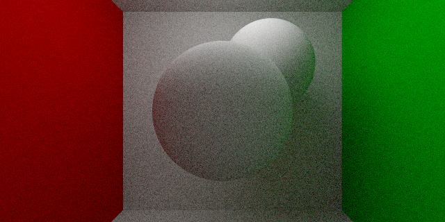
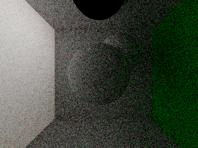

# Differentiable Path Tracing



## About

A simple differentiable path tracer based on the radiative backpropagation algorithm as proposed by Nimier-David et al. [\[2020\]][1] and the adjoint method for light transport by Jos Stam [\[2020\]][2]. Written for educational purposes, this aims to be an understandable, yet reasonably efficient implementation of the algorithm. This repository includes both the base library as well as a sample application.

## Background

Rendering algorithms, whether based on rasterization or path tracing, are tipically not a differentiable process. This can be a problem for applications which rely on taking gradients, such as when solving optimization problems. In particular, a differentiable renderer is requried when computing the loss term involves a rendering step. This is often the case in inverse rendering problems, where the goal is to estimate scene parameters based on ground-truth images. These types of renderers are also used during the training phase in some machine learning applications. Differentiable rendering algorithms solve this problem by formulating the rendering process in such a way that gradients may be obtained from pixel colors with respect to the scene parameters.

### Light Transport

Physically-based rendering algorithms model the propagation of light in a scene via the the so-called "light transport" equations. These equations (defined below) describe how light radiates in straight lines between surface points and then scatters in an energy-conserving manner. The rendering process, in effect, consists of finding approximate solutions to these equations in order to estimate the ammount of light arriving at a particular sensor (such as the pixels in a camera). This is done by using Monte Carlo integration via the path tracing algorithm, in which light paths are randomly sampled throughout the scene and their radiance determined according these same equations.

$$
\begin{align*}
	L_i(\mathbf{p}, \boldsymbol{\omega}) &= L_o(t(\mathbf{p}, \boldsymbol{\omega}), -\boldsymbol{\omega}) \\
	L_o(\mathbf{p}, \boldsymbol{\omega}) &= L_e(\mathbf{p}, \boldsymbol{\omega}) +
	  \int_{S^2} L_i(\mathbf{p}, \boldsymbol{\omega}^\prime)\ f(\mathbf{p}, \boldsymbol{\omega}, \boldsymbol{\omega}^\prime)\ \mathrm{d}\boldsymbol{\omega}^\prime
\end{align*}
$$

(Here $(\mathbf{p}, \boldsymbol{\omega})$ defines a ray with origin $\mathbf{p}$ and direction $\boldsymbol{\omega}$; $L_i$, $L_o$, and $L_e$ represent the incoming, outgoing, and emitted radiances respectively. $f$ is the bidirectional reflectance function (BRDF) and $t$ computes the first intersection of a ray.)

### Radiative Backpropagation

By taking the derivative of these equations with respect to the scene parameters (details in the aforementioned papers), we arrive at a formulation for the gradient. Here we discover that, perhaps surprisingly, these new "adjoint transport" equations are in fact very similar to the original light transport equations which we started with. Therefore, it stands to reason that we may solve these equations by using a process analogous to the path tracing algorithm. This key insight is what enables us to model the propagation of gradients throughout the scene in similar fashion to how we would with light in a process called "radiative backpropagation."

$$
\begin{align*}
	\partial_{\mathbf{x}} L_i(\mathbf{p}, \boldsymbol{\omega})
	    &= \partial_{\mathbf{x}} L_o(t(\mathbf{p}, \boldsymbol{\omega}), -\boldsymbol{\omega}) \\
	\partial_{\mathbf{x}} L_o(\mathbf{p}, \boldsymbol{\omega})
	    &= \partial_{\mathbf{x}} L_e(\mathbf{p}, \boldsymbol{\omega}) \\
	    &+ \int_{S^2} \Big[\ \partial_\mathbf{x} L_i(\mathbf{p}, \boldsymbol{\omega}^\prime)\ f(\mathbf{p}, \boldsymbol{\omega}, \boldsymbol{\omega}^\prime)
	        + L_i(\mathbf{p}, \boldsymbol{\omega}^\prime)\ \partial_{\mathbf{x}} f(\mathbf{p}, \boldsymbol{\omega}, \boldsymbol{\omega}^\prime)\ \Big]\ \mathrm{d} \boldsymbol{\omega}^\prime
\end{align*}
$$

(The above variables hold the same meaning as before while $\mathbf{x}$ is a vector representing the scene parameters.)

## Implementation

Efficient computation of the gradient is a two step process. In the forward step, we determine the radiance values along a light path as we would in a traditional path tracer. Then, in the backward step, we propagate the gradient in the opposite direction according to the differential transport equations. Perhaps the most straightforward way to implement this radiative backpropagation algorithm would be to explicitly perform both of these steps. We will be taking a more general approach by only performing the forward step explicitly, while leaving the backward step to be performed as an automatic differentiation task. Because of this, our differential path tracer implementation won't look much different from a traditional path tracer, which is a big plus. On the other hand, this approach relies on having an existing framework with some basic automatic differentiation functionality.

### Automatic Differentiation

For our purposes, we only need to support a small set of vector operations. To this end we'll be employing a strategy inspired by PyTorch, in which we record every relevant operation as part of a computation graph. We may then perform automatic differentiation by backpropagating the gradients throught this graph. In practice, every instance of our vector class will contains a `backward` method which we may call to trigger this backpropagation process:

```c++
// This declares a variable. This type of vector contains both a value and a
// gradient and will therefore always be a part of the computation graph.
// (template parameters have been ommited for brevity).
Vector x({1, 2, 3}, true);

// The following declares two constant vectors. These vectors won't be a part of
// the computation graph unless they interact with a non-constant vector.
Vector c = {4, 5, 6};
Vector d = {7, 8, 9};

// This operation is implicitly recorded by creating a new node in the graph
auto y = x + c;

// Since it only depends on two constants, this operation is not recorded but
// instead creates a new constant vector.
auto k = c + d;

// Here we explicitly define a backpropagation method by passing in a lambda
// function as and additional constructor parameter. While in this example we
// simply output a string to stdout, this alternative may be useful in cases
// when explicitly defining the backpropagation method would be more efficient
// (or accurate) than doing so implicitly.
Vector z(y, [](auto _) { std::cout << "Hello, world!" << std::endl; });

// Finally, invoking the `backward` method triggers the backpropagation process
z.backward();

// After that, gradients can be obtained from the relevant variables
x.grad()
```

### Path Tracing

By using this automatic differentiation framework as a backend to our differentiable path tracer we may implement it almost exactly as we would a traditional path tracer. This is because the path tracing algorithm is equivalent to the forward step in the differentiation process, and by implementing it we get the backward step "for free." Computing the gradient becomes just a matter of running the algorithm forward to obtain the radiance values then calling the `backward` method on the resulting vector, as seen below (details ommited for brevity):

```c++
Vector param = /* define parameter */
Scene scene = /* build scene using parameters */
Pathtracer tracer;

for (auto pixel : image) {
  auto [orig, dir] = pixel_to_ray(pixel);
  auto radiance = tracer.trace(scene, orig, dir);
  auto loss = loss_func(radiance);
  loss.backward();
}

// Access the accumulated gradient per parameter
param.grad();
```

### Avoiding Bias

While the above approach approximates gradients well enough for most applications, technically it does not yield truly unbiased results. Because our estimates rely heavily on Monte Carlo integration, we should be careful to take samples independently at each step of the differentiation process. Unfortunately, since our automatic differentiation strategy relies on recording intermediate operations, it just so happens that our backward step reuses the exact same samples as the forward step. To solve this problem, we introduce an explicit integration operator that ensures independent sampling for both steps by defining a custom backpropagation method:

```c++
template <typename Forward, typename Sampler>
struct IntegrateBackward {
    void operator()(Vector grad) const
    {
        for (size_t i = 0; i < n_samples; ++i) {
            auto [sample, pdf] = sampler();
            forward(sample).backward(grad / pdf);
        }
    }
    
    Forward forward;
    Sampler sampler;
    size_t n_samples;
};

template <typename Forward, typename Sampler>
Vector integrate(Forward forward, Sampler sampler, size_t n_samples)
{
    Vector result(0);
    for (size_t i = 0; i < n_samples; ++i) {
        auto [sample, pdf] = sampler();
        r += forward(sample) / pdf;
    }
    return Vector(r, IntegrateBackward{forward, sampler, n_samples});
}
```

Although it takes care of the bias problem, this solution comes at the cost of an increased computational complexity when computing gradients. For this reason, it's usage is not enforced since having truly unbiased estimates is often not required for most optimization problems.

## Results

The resulting gradients obtained from this implementation have been experimentally validated against those generated by using forward mode automatic differentiation. To do this, we simply ran the path tracer using [dual numbers](https://en.wikipedia.org/wiki/Dual_number) as the underlying data type instead of floating-point numbers. This simple form of automatic differentiation is analogous to using finite differences, except it is less prone to precision-related errors.




_Gradients of the pixel colors in a sample scene with respect to the parameter controlling the color of the left wall. Notice how the gradient values seem to be emitted from the wall and scatter around the scene much like light would. Results obtained using the radiative backpropagation algorithm (left) and forward mode automatic differentiation (right)._

## Limitations

It is important to note that this implementation, as well as the methods which it is based on, is not concerned with handling the visibility-related discontinuities which may arise during the rendering process. As such, it _will not_ compute the correct gradients w.r.t. parameters related to scene geometry such as object positions, rotations, etc. It will, however, compute accurate gradients w.r.t. parameters related to shading such as diffuse color, specularity, and emission strength\*. With that said, the techniques required for handling such discontinuities are largely orthogonal to the methods implemented here. Therefore, extending this implementation to handle such discontinuities should be feasible.

\*Assuming no discontinuities are present in the BRDFs themselves.

## Building

The bulk of this project has been implemented in C++11 as a header-only library with no external dependencies. Therefore, the relevant headers may be included directly from a source file and compiled without the need for linking. This repository also features a command-line tool for rendering a sample scene as a usage example. Building the command-line tool requires CMake (>=3.5) and a couple of dependencies (these have already been included as git submodules, so make sure to clone them as well). Simply running the following commands in the project's root directory should take care of compiling the system:

```
mkdir build
cd build
cmake ..
cmake --build .
```

After the build is complete, running  `./render -o <filename>` will render the sample scene and output the results to `<filename>` as an EXR file. Rendering resolution and sampling are configurable using command-line arguments (see `./render -h` for more details).

[1]: https://rgl.epfl.ch/publications/NimierDavid2020Radiative "Nimier-David. 2020. Radiative Backpropagation: An Adjoint Method for Lightning-Fast Differentiable Rendering"
[2]: https://arxiv.org/abs/2006.15059 "Jos Stam. 2020. ComputingLight Transport Gradients using the Adjoint Method"
